# Image to PETSCII converter

Online tool for creating a PETSCII representation of a custom image.  
Drag-drop your image to convert it. The stages in the conversion process are visualized.  

Live version:  
https://lysebo.xyz/tools/image-to-petscii/

Click on the gears (options) to override the detected background color.


## PETSCII?

**PETSCII** (**PET** **S**tandard **C**ode of **I**nformation **I**nterchange) is the character set being used on the Commodore 64. It consists of the following 256 characters (128 "normal" and 128 inversed characters):

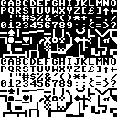<br />  

The Commodore 64 offers a palette with the following 16 colors:

  

The screen resolution is 320x200 px. There are several screen modes. This converter tool is made for the standard character mode, which has the following specs/limitations:
- The screen consists of 40x25 characters, where each character is 8x8 px
- A single character can only have one color
- There can only be one background color for the entire screen, not a different color for each character.


## Conversion process

The process is split into a preparation stage and 5 conversion stages.

### Preparation stage

Both the palette and the character map must be represented programmatically.

The palette is defined as follows:
```javascript
const palette = [
    { num: 0,  hex: "#000000", name:"Black" },
    { num: 1,  hex: "#FFFFFF", name:"White" },
    { num: 2,  hex: "#880000", name:"Red" },
    { num: 3,  hex: "#AAFFEE", name:"Cyan" },
    { num: 4,  hex: "#CC44CC", name:"Violet/purple" },
    { num: 5,  hex: "#00CC55", name:"Green" },
    { num: 6,  hex: "#0000AA", name:"Blue" },
    { num: 7,  hex: "#EEEE77", name:"Yellow" },
    { num: 8,  hex: "#DD8855", name:"Orange" },
    { num: 9,  hex: "#664400", name:"Brown" },
    { num: 10, hex: "#FF7777", name:"Light" },
    { num: 11, hex: "#333333", name:"Dark grey" },
    { num: 12, hex: "#777777", name:"Grey" },
    { num: 13, hex: "#AAFF66", name:"Light green" },
    { num: 14, hex: "#0088FF", name:"Light blue" },
    { num: 15, hex: "#BBBBBB", name:"Light grey" },
];
```

Each index of the palette is extended by creating decimal R, G, and B values from the hex color, to simplify calculations and comparisons.

```javascript
function preparePalette() {
    for(let i in palette) {
        let hex = palette[i].hex.substr(1);
        palette[i].r = parseInt(hex.substr(0,2),16);
        palette[i].g = parseInt(hex.substr(2,2),16);
        palette[i].b = parseInt(hex.substr(4,2),16);
    }
}
```

The character map is of course created on a Commodore 64 (emulator) through a short BASIC snippet like this::

<pre style="display: inline-block; border: 10px solid #0088ff; background-color: #0000aa; color: #0088ff;">
10 poke 53280,0:poke53281,0
20 print chr$(5) chr$(147)
30 let a = 1024
40 for i=0 to 255
50 poke a+i,i
60 if i-int(i/16)*16=15 then a=a+40-16
70 next i
80 goto 80
</pre>

..and then screen captured:

<br />  

Loading this into a Canvas element makes it easy to read pixel info. The Canvas object lets us even read 8x8 px chunks of the image, representing each character.

We create a reference array that contains pixel info for each character. Example info for the character "A":

```javascript
[
   false, false, false, true,  true,  false, false, false,  // ...XX...
   false, false, true,  true,  true,  true,  false, false,  // ..XXXX..
   false, true,  true,  false, false, true,  true,  false,  // .XX..XX.
   false, true,  true,  true,  true,  true,  true,  false,  // .XXXXXX.
   false, true,  true,  false, false, true,  true,  false,  // .XX..XX.
   false, true,  true,  false, false, true,  true,  false,  // .XX..XX.
   false, true,  true,  false, false, true,  true,  false,  // .XX..XX.
   false, false, false, false, false, false, false, false   // ........
]
```


### STAGE A: resize to 320x200

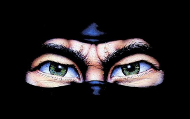

The original image is resized and centered to fit the screen resolution of 320x200 px.


### STAGE B: 16 color palette

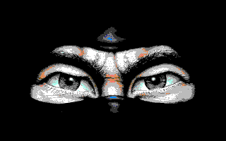

Each pixel in the resized image is converted to the nearest color in the available color palette.

This is done by calculating the "distance" between the original color and each of the colors in the palette, and then choosing the color with the shortest distance. The distance between two colors is found using the following formula:

distance² = (R1 - R2)² + (G1 - G2)² + (B1 - B2)²

R1 is the red component of color 1,  
R2 is the red component of color 2,  and so on.


### STAGE C: Detect dominant color


The screen can only have one background color. I think we'll get the best result by setting the most frequently used color as background color. The dominant color index is found by simply looping through each pixel from stage B and updating a counter for each of the 16 colors. And then selecting the index with the highest count.


### STAGE D: chunks of 8x8 px

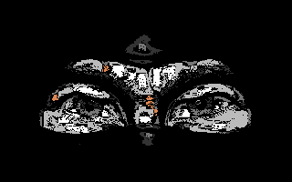

We're only allowed one color per character. Each character is 8x8 px. To prepare for the final stage we need to find the most frequently used color that is not the background color, for each 8x8 px chunk of the image. Each 8x8 px chunk will then consist of max 2 colors: the dominant (background) color and the character color.


### STAGE E: Nearest PETSCII char for each 8x8 chunk

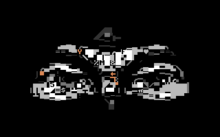  

Each character in the PETSCII reference array is also a 8x8 px chunk. We need to compare the image chunk to each of the characters in the reference array and give them a score related to the number of pixels that are either set or not set in both of them.

According to the score algorithm, the following chunk looks most like the reversed M (PETSCII index 141) with a score of 41 out of 64 similar pixels:

```
    X.XX.XX.    X..XXX..
    ..XX....    X...X...
    X.X.X.X.    X.......
    XXXX.X.. => X..X.X..
    XX.X....    X..XXX..
    X..XXXX.    X..XXX..
    ..XX.XXX    X..XXX..
    .XXXXXX.    XXXXXXXX
```

The following chunk apparently looks most like the heart (PETSCII index 83) with a score of 49 out of 64 similar pixels:

```
    .XXXXXXX    ..XX.XX.
    .XXX.XXX    .XXXXXXX
    .XXXX.XX    .XXXXXXX
    .XX.XXXX => .XXXXXXX
    .X..XXX.    ..XXXXX.
    X..X....    ...XXX..
    X..XX..X    ....X...
    ........    ........
```

### STAGE F: BASIC code

The previous stage keeps track of which character + color that is chosen for each position on screen. This list is printed out as DATA statements, which in turn is READ and POKEd to the appropriate memory addresses.

The dominant color is POKEd to 53280 and 53281.


## Misc stuff

### Examples

Images with clearly defined, large objects give better results than images with lots of detail. 

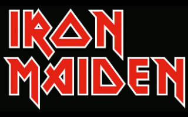  
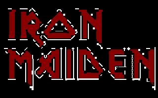  

..

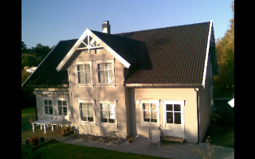  
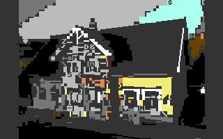  

Still, it's a lot of fun! :-D

  
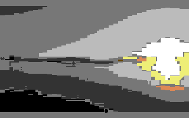  

### ..but why?

I recently rediscovered an `image2petscii.php` script that I made many years ago. It sounded like a fun thing to make an online tool with drag-drop features, and an interesting challenge to explore image processing routines with Canvas and vanilla JS.

..not to mention the obvious reason: the never ending love for the Commodore 64!


### The code

The converter tool is created using HTML/CSS (SCSS) and vanilla JavaScript. I have a nodejs/gulp tool for compiling all the parts into a single html file.


### Poor browser!

This tool is by no means resource friendly. It takes the browser as hostage until the conversion is done. I could have used requestAnimationFrame and some user friendly progress meter for each stage, but I didn't!


### The nice C64 logo

I wanted the drag-drop area to have a CBM logo as background. And I wanted to make this as an SVG. I downloaded the logo from somewhere and used is as a background while drawing the different paths of the logo, making it as accurate as possible.

Work in progress:

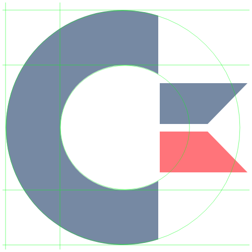  

  

Final SVG code:
```html
<svg viewbox="0 0 500 500" xmlns="http://www.w3.org/2000/svg">
    <g stroke="none">
        <path fill="#002255" d="
            M 314,31
            V 147
            A 128,124 0 1 0 314,359
            V 475
            A 232,233 0 1 1 314,31
            M 317,165 H 491 L 412,246 H 317 Z"/>
        <path fill="#ff0000" d="
            M 317,261 H 412 L 491,342 H 317 Z"/>
    </g>
</svg>
```


The options symbol is also created as an SVG:

```html
<svg viewbox="0 0 500 500" xmlns="http://www.w3.org/2000/svg">
    <mask id="bar" stroke="none">
        <rect x="0" y="0" width="100" height="100" fill="white" />
        <circle cx="50" cy="50" r="14" fill="black" />
    </mask>
    <g stroke="#bbbbbb" stroke-width="20" fill="none" mask="url(#bar)">
        <path d="M50,5 V95" />
        <path d="M50,5 V95" transform="rotate(60 50 50)" />
        <path d="M50,5 V95" transform="rotate(-60 50 50)" />
        <circle stroke="none" fill="#bbbbbb" cx="50" cy="50" r="33" />
    </g>
</svg>
```


### Standard Character Mode vs Extended Color Mode

A really fun improvement (or option) (or parallell project) would be converting an image into PETSCII using Extended Color Mode. This is a special text mode that allows 4 different background colors, but limits the PETSCII table to the first 64 characters.

I might do this some time. Until then, I'll just show an example of how to utilise the extended text mode.

<pre style="display: inline-block; border: 10px solid #0088ff; background-color: #0000aa; color: #0088ff;">
10 poke 53281,0: rem define bgcolors
20 poke 53282,2
30 poke 53283,5
40 poke 53284,6
50 poke 53265,peek(53265) or 64: rem activate mode
60 print chr$(5) chr$(147): rem clrscr white crsr
70 for i=0 to 255
80 poke 1024+i,i
90 next i
100 goto 100
</pre>

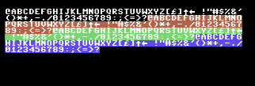  

